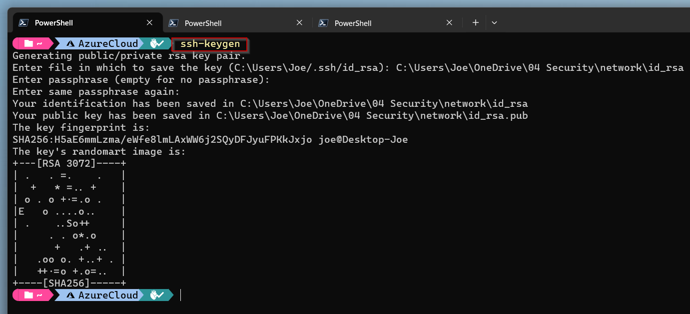

# Add `non root` user on docker host and enable ssh access

[Back](../README.md)

I don't want to have to work with the root user on my Docker host. For this reason, I always create a dedicated user who must also be authorised for the Docker daemon.

These are the necessary steps:

1. Add the new user (and give him a proper password):

   ```bash
   adduser network
   Adding user 'network' ...
   Adding new group 'network' (1002) ...
   Adding new user 'network' (1002) with group 'network' ...
   Creating home directory '/home/network' ...
   Copying files from '/etc/skel' ...
   New password: 
   Retype new password: 
   passwd: password updated successfully
   Changing the user information for network
   Enter the new value, or press ENTER for the default
        Full Name []: 
        Room Number []: 
        Work Phone []: 
        Home Phone []: 
        Other []: 
   Is the information correct? [Y/n]
   ```

2. Add the newly created user to the `sudo` group:

   ```bash
   usermod -aG sudo network
   ```

3. Verify the group memberships of the `network` user:

   ```bash
   groups network
   network : network sudo
   ```

4. Switch to the `network` user

   ```bash
   su - network
   ```

5. Verify the sudo command:
  
   ```bash
   sudo ls /root
   ```

   This should work without any errors!

6. Create a `.ssh` folder in the home directory

   ```bash
   mkdir ~/.ssh
   ```

7. Edit the `~/.ssh/authorized_keys` file and paste your public SSH key:

   ```bash
   nano ~/.ssh/authorized_keys
   ```

   If you haven't any SSH keys yet you can easly create on on windows with the `ssh-keygen` command:

   

8. Secure your `~/.ssh/authorized_keys` file with just owner read/write permissions:

   ```bash
   chmod 600 ~/.ssh/authorized_keys
   ```

9. Test the ssh connection from the work computer:

    ```powershell
    ssh network@docker.local
    ```

    If you aren't using your default ssh key for the connection then you have to use the `-i` parameter to use the correct private key. e.g.:

    ```powershell
    ssh -i <path to your private ssh key> network@docker.local
    ```

## References

- [How to Add User to Sudoers or Sudo Group on Ubuntu](https://phoenixnap.com/kb/how-to-create-sudo-user-on-ubuntu)
- [How to create a sudo user on Ubuntu and allow SSH login](https://thucnc.medium.com/how-to-create-a-sudo-user-on-ubuntu-and-allow-ssh-login-20e28065d9ff)
- [Creating and Using SSH Keys in Windows](https://www.purdue.edu/science/scienceit/ssh-keys-windows.html)

[Back](../README.md)
